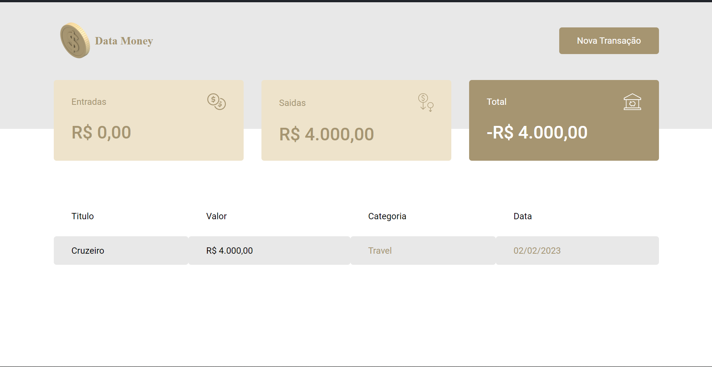

<h1 align="center"> DT.Money</h1>

    Projeto DT.Money (Gerenciador Financeiro)
 

  <a href="#-tecnologias">Tecnologias</a>&nbsp;&nbsp;&nbsp;|&nbsp;&nbsp;&nbsp;
  <a href="#-projeto">Projeto</a>&nbsp;&nbsp;&nbsp;|&nbsp;&nbsp;&nbsp;
  <a href="#-layout">Layout</a>&nbsp;&nbsp;&nbsp;|&nbsp;&nbsp;&nbsp;
  <a href="#memo-licença">Licença</a>

  

 

  

## 🚀 Tecnologias

Esse projeto foi desenvolvido com as seguintes tecnologias:

- React
- Typescript
- Styled-component
- MirageJS

## 💻 Projeto
Aplicação Web para administração financeira pessoal.

- [Acesse o projeto finalizado, online](https://dt-money-olive.vercel.app)

## 🔖 Layout

Você pode visualizar o layout do projeto através [DESSE LINK](https://xd.adobe.com/view/4e64561f-79d7-49e5-8823-e2727577b7f7-1b37/)

## :memo: Licença

Esse projeto está sob a licença MIT.
